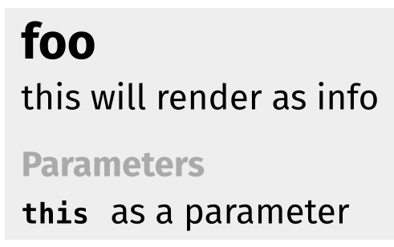

# typst-autodoc

Automaticaly generate a documentation pdf for your library using java docstring format

```typst
/**
 * this will render as info
 * @param this as a parameter
 */
#let foo(this)= {}

#import "typst-autodoc.typ": main
#main("this.typ")
```


Supported : `@param`, `@see`, `@version`, `@returns`, more if needed

example.pdf coincidentally also documents the (few) functions of the library itself

## Features
unticked boxes aren't supported (currently)

- [x] parse basic function /**
- [x] render the docstrings with typst syntax (WARNING: `eval`)
- [x] automatically insert [links]()
- [ ] ignore trailing docstrings
- [ ] parse nested comments
- [ ] parse arguments with default arrays/dictionariess
- [ ] parse variables